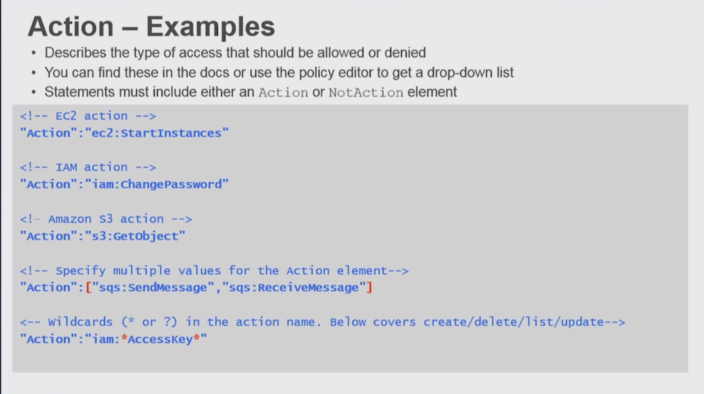
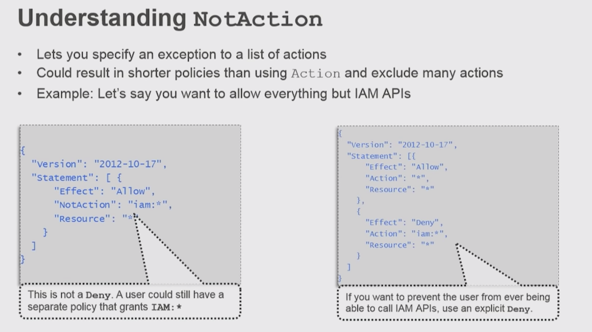
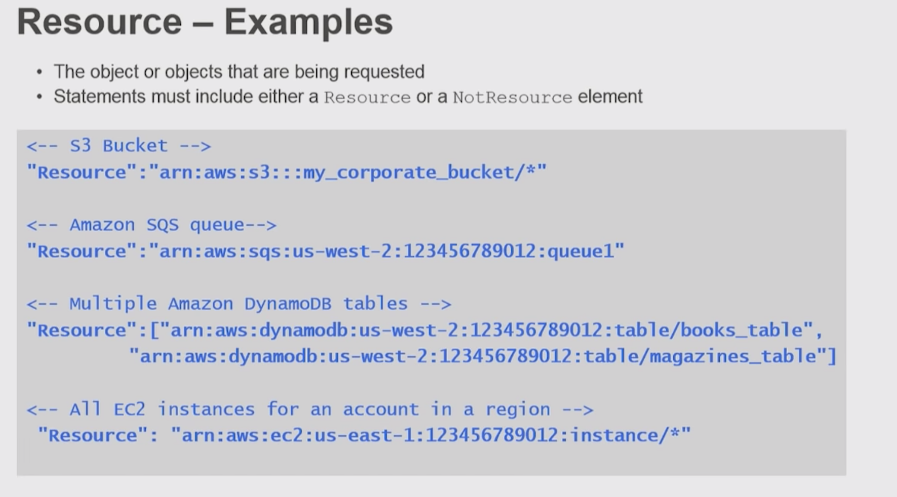
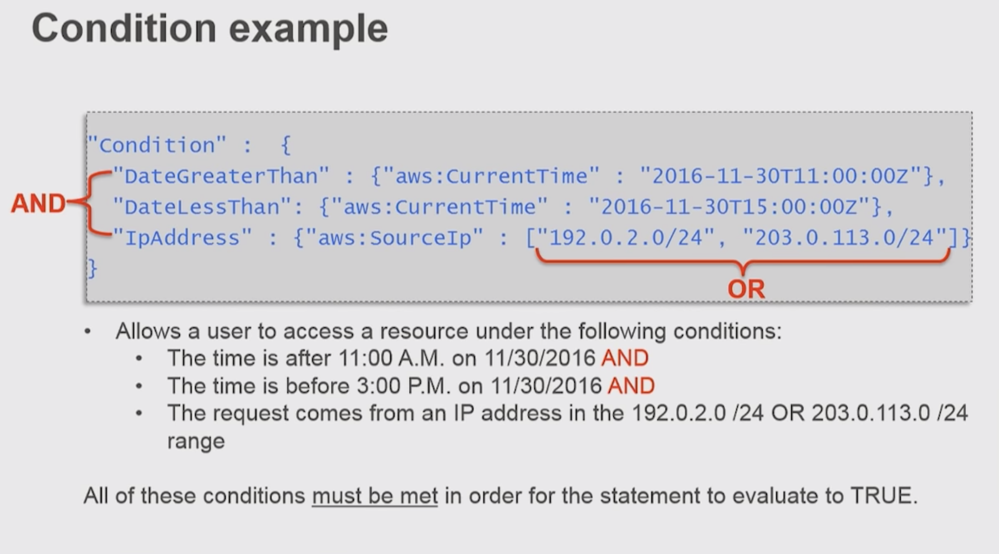
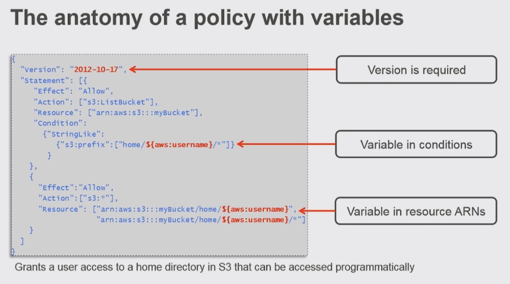

# IAM

https://aws.amazon.com/iam/faqs/

## ARN
amazon resource names

- User Based
- Resource Based

## groups
- collection of IAM users
- users assume permissions of the group
- users can belong to multiple groups
- groups can only contain users, cannot be nested
- 100 groups per account
- costs cannot be tracked by user, group or fole
- instead use cost allocation tags and view in Billing and Cost Management

## roles
- defined permissions that can be assumed by users or resources

## federated users
- amazon cognito
- google
- facebook, etc

## Policy

### PARC model
#### `Effect`
* allow
* deny

#### `Principal`
* if attaching to a user/role, you dont need it, cause it goes with the user/role
* if attaching to a resourece like a bucke, use it
* entity that is allowed access
* `arn`

#### `Action`
* type of access that is allowed or denied

#### `Resource`
* `arn`

#### `Condition`
* conditions under what this is true

### Variables

## FAQ
Q: What is a user?
* unique identity recognized by AWS services and applications. 
* Similar to a login user in an operating system like Windows or UNIX, 
* has a unique name and can identify itself using familiar security credentials such as a password or access key. 
* can be an individual, system, or application requiring access to AWS services. 
* IAM supports users (referred to as "IAM users") managed in AWS's identity management system, and it also enables you to grant access to AWS resources for users managed outside of AWS in your corporate directory (referred to as "federated users").

Q: What can a user do?
A user can place requests to web services such as Amazon S3 and Amazon EC2. A
user's ability to access web service APIs is under the control and
responsibility of the AWS account under which it is defined. You can permit a
user to access any or all of the AWS services that have been integrated with IAM
and to which the AWS account has subscribed. If permitted, a user has access to
all of the resources under the AWS account. In addition, if the AWS account has
access to resources from a different AWS account, its users may be able to
access data under those AWS accounts. Any AWS resources created by a user are
under control of and paid for by its AWS account. A user cannot independently
subscribe to AWS services or control resources.

Q: What is the difference between an IAM role and an IAM user?
An IAM user has permanent long-term credentials and is used to directly interact
with AWS services. An IAM role does not have any credentials and cannot make
direct requests to AWS services. IAM roles are meant to be assumed by authorized
entities, such as IAM users, applications, or an AWS service such as EC2.

Q: When should I use an IAM user, IAM group, or IAM role?

An IAM user has permanent long-term credentials and is used to directly interact
with AWS services. An IAM group is primarily a management convenience to manage
the same set of permissions for a set of IAM users. An IAM role is an AWS
Identity and Access Management (IAM) entity with permissions to make AWS service
requests. IAM roles cannot make direct requests to AWS services; they are meant
to be assumed by authorized entities, such as IAM users, applications, or AWS
services such as EC2. Use IAM roles to delegate access within or between AWS
accounts.
